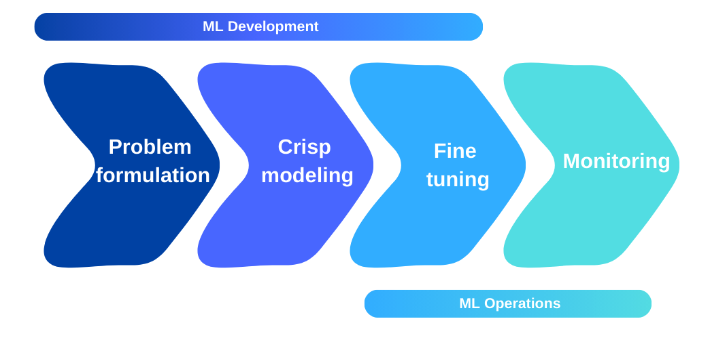
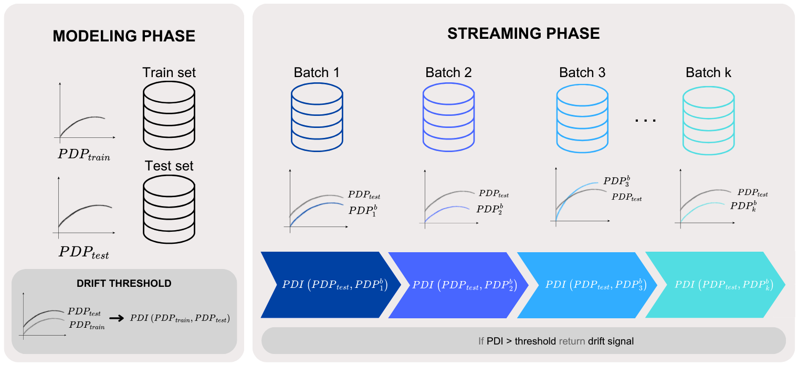
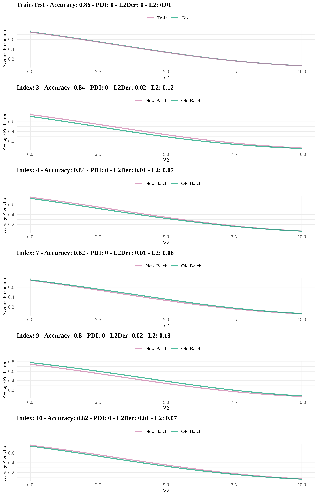
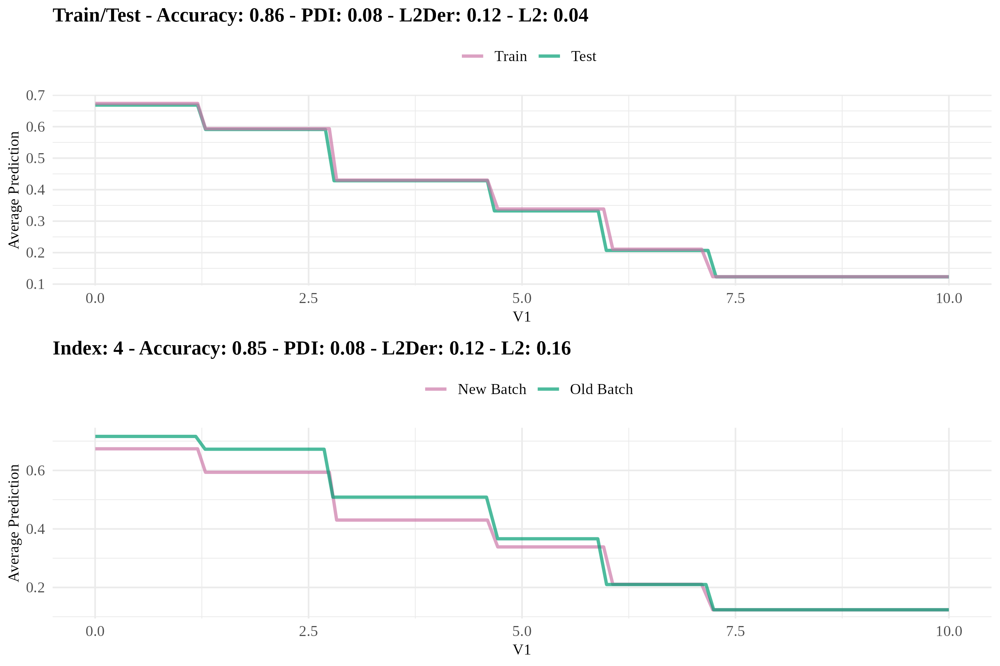
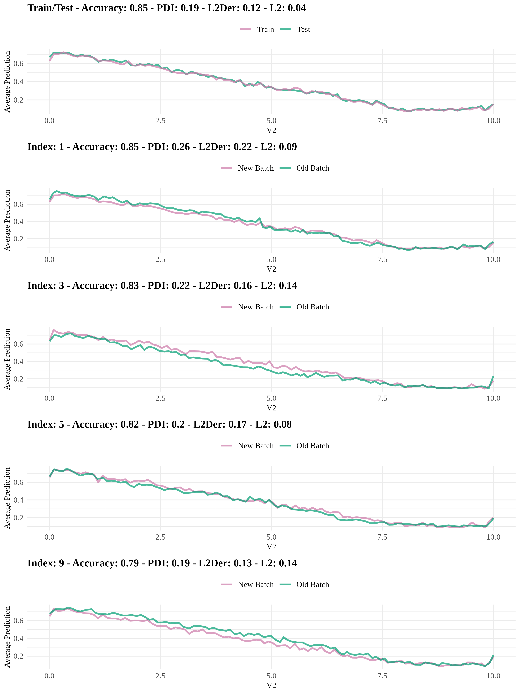
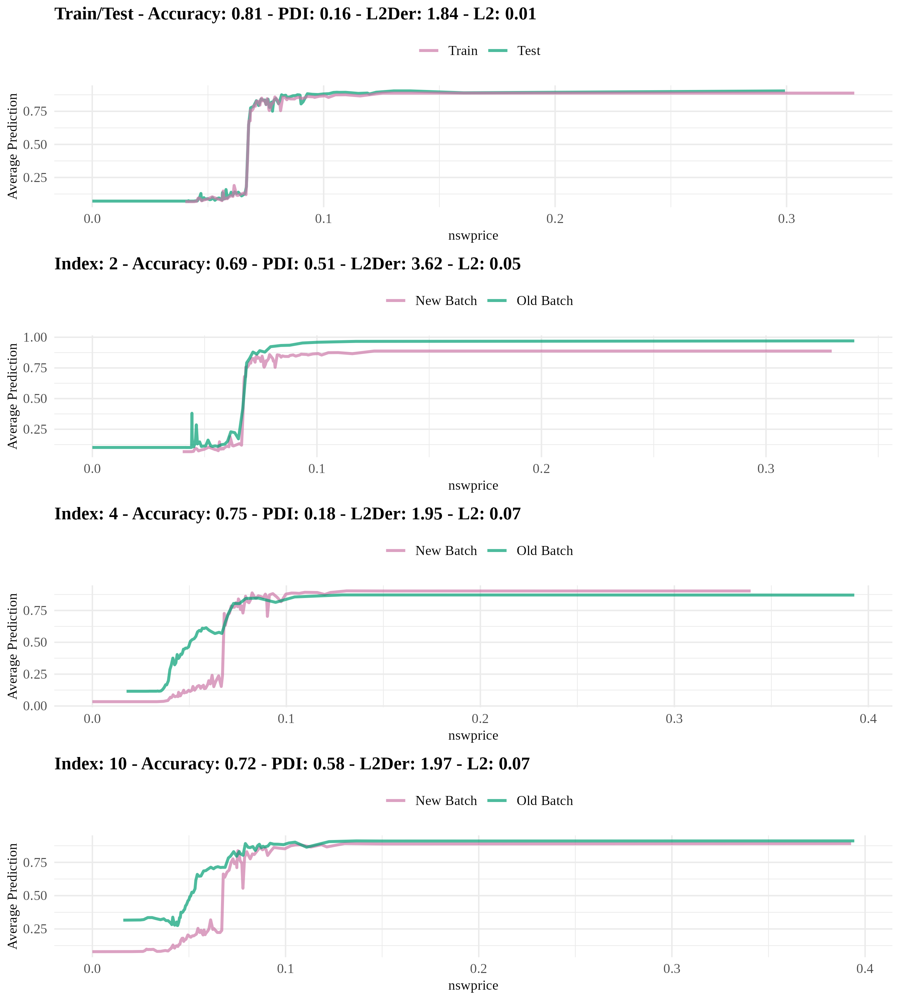

```{r setup, include=FALSE}
knitr::opts_chunk$set(echo = FALSE, warning = FALSE, message = FALSE)
library(plotly)
library(ggplot2)
library(palmerpenguins)
library(kableExtra)
knitr::opts_chunk$set(fig.pos = 'H',fig.align='center')
```

# Introduction

The stationary and unbiased distribution assumption in predictive models refers to the assumption that observations in train and test sets are independent and identically distributed \citep{cieslak_and_chawla_2009}. However, this assumption often does not hold in practice, leading to significant decreases in the performance of predictive models \citep{alaiz_et_al_2008}. Data characteristics can change over time, rendering a trained model obsolete and forcing it to adapt to these changes. The constantly evolving nature of data streams presents new challenges for predictive models \citep{moreno_et_al_2012}. These models must demonstrate high predictive accuracy and quickly incorporate new information while remaining computationally light and responsible \citep{korycki_and_krawczyk_2023}. Model monitoring, which is a part of MLOps, has become a necessary additional layer in the predictive modeling process in Figure~\ref{fig:mdp} to ensure that the ML model maintains consistent behavior over time in real-world applications \citep{biecek_2019, mougan_and_nielsen_2023}.


```{r mdp, out.width = "80%", out.height = "20%", fig.cap = "The predictive modeling process"}

```

One of the problems that causes inconsistency in behavior is called data drift whose types are also classified into three categories: (1) Covariate drift, (2) Label drift, and (3) Concept drift. Data drift may manifest in various forms such as increased electricity consumption due to significant life changes like pandemic-related lockdowns \citep{fumagalli_et_al_2023}, changes in airline customer behaviors \citep{garg_et_al_2021}, and shifts in supply chain planning due to evolving consumer behavior \citep{kulinski_and_inouye_2023}. It is essential to detect these drifts on time to take precautions about the model.

Various methods are used to detect data drifts, categorized into three groups: statistical, sequential analysis-based, and window-based methods. For detecting concept drift, which is characterized as a change in the relationship between explanatory variables and the response variable, there are instances where current methods in the literature fall short \citep{demvsar_and_bosnic_2018, duckworth_et_al_2021, rahmani_et_al_2023}. This limitation highlights the need for MLOps, which integrates model monitoring and adaptation strategies to address data drift effectively. MLOps practices focus on maintaining model performance and managing change, enabling predictive models to adapt in real time to dynamic data environments. One particularly challenging scenario is when concept drift occurs without changes in performance and distribution metrics, rendering traditional detection methods unreliable. In response to this situation, some alternative approaches have been proposed where the methods used in the literature fail to detect concept drift adequately. 

Moreover, \cite{demvsar_and_bosnic_2018} emphasized that current data drift detection methods rely solely on performance and distribution metrics, which are insufficient to understand the underlying cause of changes in the model. They developed an alternative method using the local interpretable model-agnostic explanations \citep{strumbelj_et_al_2009} and demonstrated through comparative studies that it offers better detection performance than existing methods. \cite{duckworth_et_al_2021} used the normalized SHAP method \citep{lundberg_2017} to detect data drifts in emergency department length-of-stay prediction models following COVID-19, noting that traditional methods failed to reflect changes in the model's information utilization. \cite{muschalik_et_al_2022} developed an approach to detect concept drifts using permutation-based variable importance \citep{breiman2001random} values. However, they highlighted the need to address complexity, effectiveness, sensitivity, and explainability for their approach to be effectively applied. \cite{rahmani_et_al_2023} explored data drifts observed in models using the SHAP method for calculating the variable importance. Their most significant challenge was the inability to distinguish between covariate and concept drift, primarily due to the inappropriate use of XAI tools. While SHAP provides sufficient information on variable importance, it fails to detect the relationship between explanatory and response variables. \cite{mougan_and_nielsen_2023} emphasized that statistical tests operate solely based on the data distribution and may lead to false alarms. Their study developed an explainable concept drift detection method for regression problems using non-parametric bootstrap uncertainty estimation and SHAP values. \cite{mattos_et_al_2021} highlighted a lack of studies focusing on the causes and explainability of concept drift detection methods. They developed a technique based on a decision tree model to detect and visualize concept drift by identifying changes in the regions partitioned by the decision tree. However, they discussed the limitations of their approach, such as the cost of continuously training the model and the feasibility of tracking the limited number of variables selected by the model. Additionally, when non-tree-based models are used, the method might evaluate different relationships from those in the decision process, making it more suitable as a tree-based method. \cite{muschalik_et_al_2022} developed an approach for detecting concept drift using permutation-based variable importance values. Similarly, \cite{fumagalli_et_al_2023} developed an incremental permutation-based variable importance method for use in incremental models. However, they emphasized that for their approach to be effectively applied, it is necessary to address shortcomings in complexity, efficiency, sensitivity, and explainability.

There is a limited body of literature on data drift detection methods that employ XAI tools. Even when these methods are used, they often face challenges in some data drifts, or they rely on high computational cost methods such as permutation-based variable importance or SHAP. These approaches are not always practical for detecting changes in the relationship between the response variable and explanatory variables. Therefore, this paper introduces a solution based on the partial dependence profile (PDP), which is an XAI tool used to uncover the relationship between the response variable and explanatory variables. Because it is a versatile tool that is not only used to examine the relationship between the response variable and explanatory variables but also used in hyper-parameter optimization \citep{moosbauer_et_al_2021} and for determining variable importance and identifying interactions between variables \citep{inglis_et_al_2022}.

In addition to the scientific literature, software, and technologies that include data drift detection methods that are complex to implement are quite limited. Although there are basic R tools such as the \CRANpkg{vetiver} framework and \CRANpkg{pins} for monitoring model metrics, they do not provide specific instruments for data drift monitoring. On the other hand, \CRANpkg{drifter} offers useful functions for detecting data drift based on distances between distribution, residuals, and PDPs of two models, but it is limited to comparing two trained models and is not suitable for streaming data. Meanwhile, \CRANpkg{harbinger} supplies some functions to detect anomalies, drifts, and change points but is focused on time series data. While R and CRAN are immature in terms of model monitoring, there are many technologies and Python libraries available such as EvidentlyAI\footnote{\href{https://www.evidentlyai.com/}{https://www.evidentlyai.com/}}, SeldonIO\footnote{\href{https://www.seldon.io/}{https://www.seldon.io/}}, NannyML\footnote{\href{https://nannyml.readthedocs.io/en/stable/index.html}{https://nannyml.readthedocs.io/en/stable/index.html}}, Frouros\footnote{\href{https://frouros.readthedocs.io/en/latest/}{https://frouros.readthedocs.io/en/latest/}}, River\footnote{\href{https://riverml.xyz/0.8.0/examples/concept-drift-detection/}{https://riverml.xyz/0.8.0/examples/concept-drift-detection/}}.

To address these gaps, we propose a new concept drift detection method based on XAI and the \CRANpkg{datadriftR} package, leveraging PDP to monitor data drifts in model development. The key result of our study is the efficiency of this method in concept drift detection compared to existing tools and it provides explanations to understand the underlying cause of changes in the model. To the best of our knowledge, \CRANpkg{datadriftR} is the first package that consists of an explainable and the other mostly used drift detection method. The rest of the paper is organized as: the following section provides the preliminaries about the data drifts. Then, the concept drift detection methods considered in the introduced package, are given. The performance of these methods is compared in terms of synthetic and real-world datasets. Finally, we conclude with a summary of future works.

# Preliminaries


Let $f_{\theta}: \mathcal{X} \rightarrow \mathcal{Y}$ be a predictive model, where $f_{\theta}$ represents the function learned by the model, $\theta$ denotes the parameters to be optimized, $\mathcal{X}$ is the input space, and $\mathcal{Y}$ is the output space. The model is trained on a dataset $D = \{(x_i, y_i)\}_{i=1}^{n}$, where $x_i \in \mathcal{X}$ are the explanatory variables and $y \in \mathcal{Y}$ is the response variable. The learning process aims to find the optimal parameters $\hat{\theta}$ by minimizing a loss function $L(f_{\theta}(x_i), y_i)$, which quantifies the difference between the model's predictions $f_{\theta}(x_i)$ and the true values $y_i$. The objective is to solve $\hat{\theta} = \arg \min_{\theta} \sum_{i=1}^{n} L(f_{\theta}(x_i), y_i)$, thereby achieving the best possible model performance on the given data. Data drift occurs when there is a discrepancy between the distribution of the data used to train a model, denoted as $P_{\text{train}}(X, Y)$, and the distribution of the data the model encounters during deployment or testing denoted as $P_{\text{test}}(X, Y)$. This drift can negatively impact the model's performance, as the model learns patterns based on the train data distribution.

\noindent \textbf{Covariate drift.} It occurs when the distribution of explanatory variables changes while the distribution of response variable remains unchanged: $P_{\text{train}}(X) \neq P_{\text{test}}(X)$. In this case, the model might struggle to make accurate predictions on new data, even though it performed well on the train set.

\noindent \textbf{Label drift.} It indicates a change in the distribution of the response variable while the distribution of the explanatory variable stays constant: $P_{\text{train}}(Y) \neq P_{\text{test}}(Y)$. Label shift is particularly problematic in scenarios with imbalanced classes, as it can increase misclassification rates.

\noindent \textbf{Concept drift.} In this case, both the distribution of response and explanatory variable change, which can significantly alter how the model interprets the data: $P_{\text{train}}(X, Y) \neq P_{\text{test}}(X, Y)$, leading to reduced accuracy and reliability.

\noindent There are several methods proposed to detect these kinds of drifts in the literature are described in the following section.

# Methods


This section describes the existing drift detection methods such as Drift Detection Method, Early Drift Detection Method, Hoeffding Drift Detection Methods, Kolmogorov-Smirnov test-based Windowing, and Page-Hinkley, as well as our proposed concept drift detection method Profile Drift Detection.

## Hoeffding’s Drift Detection Method on Average

The HDDM method \citep{frias_blanco_2015} includes two different approaches: mean and weighted. Both methods are based on Hoeffding's Inequality.

HDDM-A is used to detect abrupt concept drifts in data streams. It monitors changes in the data stream using a simple moving average and detects significant modifications based on Hoeffding's Inequality. Similar to DDM, two different confidence levels are set for alert and concept drift detection. Confidence levels $\alpha_D$ are set for detecting concept drift and $\alpha_W$ for detecting alerts. The total number of samples is denoted by $n$, and the cumulative sum for each new sample is $c = \sum_{i=1}^{n} x_i$. The data stream is divided into two windows: minimum window $(n_{\text{min}}, c_{\text{min}})$ and maximum window $(n_{\text{max}}, c_{\text{max}})$. These windows are used to compare the past and current states of the data. If the minimum and maximum window values are in their initial state, they are updated (if $n_{\text{min}} = 0$ then $n_{\text{min}} = n$, $c_{\text{min}} = c$; if $n_{\text{max}} = 0$ then $n_{\text{max}} = n$, $c_{\text{max}} = c$). Error bounds for the minimum window and total sample size are calculated using Hoeffding's Inequality:
\begin{equation}
\epsilon_{\alpha_D} = \sqrt{\frac{1}{2n} \ln \left(\frac{1}{\alpha_D}\right)}
\end{equation}

\begin{equation}
\epsilon_{\alpha_{D1}} = \sqrt{\frac{1}{2n_{\text{min}}} \ln \left(\frac{1}{\alpha_D}\right)}
\end{equation}

\begin{equation}
\epsilon_{\alpha_{D2}} = \sqrt{\frac{1}{2n_{\text{max}}} \ln \left(\frac{1}{\alpha_D}\right)}
\end{equation}

Using these bounds, the values of $n_{\text{min}}$, $c_{\text{min}}$, $n_{\text{max}}$, and $c_{\text{max}}$ are updated as follows:

\begin{equation}
\text{If } \frac{c_{\text{min}}}{n_{\text{min}}} + \epsilon_{\alpha_{D1}} \geq \frac{c}{n} + \epsilon_{\alpha_D} \text{ then } c_{\text{min}} = c, \; n_{\text{min}} = n
\end{equation}

\begin{equation}
\text{If } \frac{c_{\text{max}}}{n_{\text{max}}} - \epsilon_{\alpha_{D2}} \leq \frac{c}{n} - \epsilon_{\alpha_D} \text{ then } c_{\text{max}} = c, \; n_{\text{max}} = n
\end{equation}

\begin{equation}
\frac{c}{n} - \frac{c_{\text{min}}}{n_{\text{min}}} \geq \sqrt{\frac{n - n_{\text{min}}}{n_{\text{min}}} \frac{1}{2n} \ln \left(\frac{1}{\alpha}\right)}
\end{equation}

\begin{equation}
\frac{c_{\text{max}}}{n_{\text{max}}} - \frac{c}{n} \geq \sqrt{\frac{n - n_{\text{max}}}{n_{\text{max}}} \frac{1}{2n} \ln \left(\frac{1}{\alpha}\right)}
\end{equation}

When the conditions in Equation 6 or 7 are met, with $\alpha$ replaced by $\alpha_D$, a concept drift is detected, and an alert state is identified when $\alpha_W$ is used.

## Hoeffding’s Drift Detection Method on Weighted


HDDM-W is an algorithm that uses Exponentially Weighted Moving Averages (EWMA) to detect concept drifts in data streams. This algorithm tracks average changes occurring in the data stream and determines whether these changes are significant using Hoeffding's Inequality. The parameter \(\lambda\) is used in the EWMA statistic, where smaller values give less weight to the most recent observations and \(\lambda\) ranges from 0 to 1. It is calculated as \(\hat{\mu}_{\text{EWMA}} = \lambda_{x_i} + (1 - \lambda) \hat{\mu}_{\text{EWMA}}\). Similarly, separate \(\alpha\) values must be set for concept drift and alert states.

While HDDM-A is generally more effective in detecting abrupt concept drifts, HDDM-W performs better in detecting gradual concept drifts. HDDM algorithms do not make any distribution assumptions for the observations being compared. Variables can take values in the range \([a, b]\), and Hoeffding's Inequality can be used. However, in practice, Python modules such as scikit-multiflow and river, similar to DDM and EDDM, attempt to detect concept drift based on whether the response variable is correctly predicted.

## Kolmogorov-Smirnov Windowing Method

KSWIN is a non-parametric statistical method used to detect concept drifts in data streams \citep{raab_2020}. This method utilizes the Kolmogorov-Smirnov test (KS test) to identify statistical differences between new and historical data.

It operates using a sliding window (\(\Psi\)) that continuously holds the most recent \(n\) data points. Two sub-windows are created from \(\Psi\):

\begin{itemize}
    \item \(R\), which contains the most recent \(r\) observations:
    \begin{equation}
    R = \{x_i \in \Psi \mid i > n - r\}
    \end{equation}
    \item \(W\), which contains \(r\) observations randomly chosen from the older part of the window:
    \begin{equation}
    W = \{x_i \in \Psi \mid i \leq n - r \text{ and } P(x) = \text{UNIF}(x_i \mid 1, n - r)\}
    \end{equation}
\end{itemize}

where \(|W| = |R| = r\). The Kolmogorov-Smirnov (KS) test is then applied to compare the empirical cumulative distributions of \(R\) and \(W\). The test calculates the maximum absolute difference between these distributions (\(dist_{w,r}\)):

\begin{equation}
dist_{w,r} = \sup_x \left| F_W(x) - F_R(x) \right|
\end{equation}

If this distance exceeds the critical value (\(D_\alpha\)), it indicates a concept drift:

\begin{equation}
dist_{w,r} > c(\alpha) \sqrt{\frac{n + r}{nr}} = \sqrt{-\frac{1}{2} \ln \alpha} \sqrt{\frac{n + r}{nr}} = \sqrt{-\frac{\ln \alpha}{r}}
\end{equation}

When the distribution \(P(X)\) changes over time while \(P(y \mid X)\) remains the same, this indicates a virtual concept drift. The KSWIN test is used to detect concept drift under the assumption that any change in \(P(X)\) will also result in a change in \(P(y \mid X)\). Since the KSWIN test is non-parametric, there is no need to assume any specific distribution for the monitored variable. The KSWIN test can be applied to either the response variable or explanatory variables and is used to detect data drift even before actual values are observed, by using explanatory variables to predict the response variable.

## Page-Hinkley Test

Page-Hinkley Test (PH) is a method used to detect changes in mean values in data streams, similar to Cumulative Sums \citep{sebastiano_fernandes_2017}. This method is designed to determine whether the average of the data obtained over a certain observation period remains constant. The key difference is the \(\alpha\) forgetting factor, which weights the observed values and the average, reducing the impact of older data. In the algorithm, initially \(n = 1\), \(x_{\text{ort}} = 0\), and \(S = 0\) are set. For each incoming \(t\)-th observation, the following operations are performed:

\begin{equation}
x_t = x_{\text{ort}} + \frac{x_t - x_{t-1}}{n}
\end{equation}

\begin{equation}
S_t = \max \left(0, \alpha \cdot S_{t-1} + x_t - x - \delta \right)
\end{equation}

\noindent If \(S_t > \lambda\), it indicates the detection of a concept drift. PH can be used to test whether there is a change in the distribution of explanatory variables or the response variable, similar to the KSWIN test. For detecting concept drift, it is not necessary to wait for the actual value of the response variable predicted by the model. The PH test does not include an alert state.

## Drift Detection Method


The Drift Detection Method (DDM) is used to detect changes in the response variable (class label) in binary classification problems \citep{gama_2004}. This method is applied in situations where the data stream is continuous and is used to evaluate the model's performance each time a new example arrives. It is assumed that new observations arrive with true values in the form of \((x_i, y_i)\). The model predicts the value \(\hat{y_i}\) for the incoming observations as either Correct or Incorrect. The prediction values being Correct or Incorrect can be modeled with a Bernoulli distribution. When \(n\) observations are received, this distribution is modeled with a Binomial distribution. Let \(i\) be the number of examples:

\begin{itemize}
  \item \textbf{Error Rate} (\(p_i\)): The proportion of errors made by the model at the \(i\)-th example. It is calculated over a specific set of examples and is the ratio of incorrectly classified examples to the total number of examples.
  \item \textbf{Standard Deviation} (\(s_i\)): A value measuring the variance of the error rate at the \(i\)-th example, calculated as \(s_i = \sqrt{p_i(1 - p_i)/i}\).
\end{itemize}

The error rate (\(p_i\)) is a random variable derived from Bernoulli trials and represented by a binomial distribution. For sufficiently large sample sizes, the binomial distribution approximates a normal distribution with the same mean and variance. The confidence interval for \(p_i\) at \(1 - \alpha/2\) is calculated as \(p_i \pm \alpha \cdot s_i\).

DDM monitors an increase in the error rate. If \((p_i + s_i)\) exceeds a certain threshold, it indicates concept drift. For a 95\% confidence interval, a warning level is suggested as \(p_i + s_i \geq p_{\text{min}} + 2 \cdot s_{\text{min}}\). For a 99\% confidence interval, a drift level is suggested as \(p_i + s_i \geq p_{\text{min}} + 3 \cdot s_{\text{min}}\). DDM is a model-independent, easily applicable algorithm. Since it only attempts to detect concept drift through the response variable, it cannot be used to detect virtual concept drift occurring in explanatory variables.


## Early Drift Detection Method

The Early Drift Detection Method (EDDM) algorithm is similar to the DDM algorithm and is designed to detect concept drift in binary classification problems \citep{baena_garcia_2006}. The main difference is that, while DDM calculates the error rate for each incoming \((x_i, y_i)\) observation, EDDM calculates the distance between these errors.

The average distance between two errors \(p'_i\) and the standard deviation of this distance \(s'_i\) are computed and recorded. These values are saved when \(p'_i + 2 \cdot s'_i\) reaches its maximum \((p'_{\text{max}} \text{ and } s'_{\text{max}})\). This maximum value indicates the moment when the model best represents the current concepts in the dataset. EDDM, like DDM, has two different threshold values for warning and drift levels:

\begin{itemize}
  \item \textbf{Warning Level:} 
  \begin{equation}
  \frac{p'_i + 2 \cdot s'_i}{p'_{\text{max}} + 2 \cdot s'_{\text{max}}} < \alpha
  \end{equation}
  where \(\alpha\) is suggested to be 0.95.
  
  \item \textbf{Drift Level:} 
  \begin{equation}
  \frac{p'_i + 2 \cdot s'_i}{p'_{\text{max}} + 2 \cdot s'_{\text{max}}} < \beta
  \end{equation}
  where \(\beta\) is suggested to be 0.90.
\end{itemize}

After detecting concept drift, the model is assumed to be retrained to fit the new concept, and \(p'_{\text{max}}\) and \(s'_{\text{max}}\) values are reset. EDDM is designed to detect slowly better-occurring concept drifts and performs well against sudden changes. Like DDM, EDDM detects concept drift based on the response variable, so it cannot be used to detect virtual concept drift occurring in the explanatory variables.

## Profile Drift Detection

The combination of L2 distance, first-order derivative distance (L2Der), and the Partial Dependence Index (PDI) methods allows for a comprehensive assessment of various aspects of PDP comparisons \citep{kobylinska_2024}. L2 distance measures the overall difference and magnitude between two profiles. This method evaluates the structural similarity or differences between PDP shapes by considering squared differences between values across all points in the profiles. The L2Der compares the derivatives of profiles to analyze the rate and severity of changes within profiles. Comparing derivatives effectively identifies differences in slopes and local changes, aiding in understanding both the general shapes and dynamic behaviors of profiles. PDI focuses on whether profiles show an increase or decrease at the same data points, evaluating behavioral similarities by taking into account orientation changes between profiles. This index quantitatively expresses differences in profiles’ trends and reveals opposing or similar behaviors. The use of these three methods together provides a holistic measure and analysis of the distance, change rates, and orientation differences between profiles. This allows for a deeper understanding of both the general similarity and behavior at different data points within PDPs. The difference in PDPs analyzed with these three metrics is referred to as PDD illustrated in Figure~\ref{fig:pdd}.


```{r pdd, out.width = "80%", out.height = "20%", fig.cap = "The workflow of the Profile Drift Detection"}

```


The three metrics used by PDD (PDI, L2, L2Der) can be set as parameters. In our prior studies \citep{dar_2023, dar_2024}, only the PDI metric was used to attempt to detect concept drift, but it was found to be insufficient on its own in some cases. PDD, on the other hand, incorporates both the L2 and L2Der metrics in addition to PDI. The thresholds set for the three metrics in Algorithm~\ref{algo} should be appropriate for \textit{acceptable} deviations.

\begin{algorithm}[H]
\SetAlgoLined
\KwIn{Train and test sets}
\KwOut{$test\_accuracy$, $train\_accuracy$, $drift\_count$, $accuracy$}
Calculate the sizes of the train and test sets according to the given number of batches\;
$model \gets$ model trained on the train set\;
$test\_accuracy$, $train\_accuracy \gets$ Calculate the accuracy rates for the train and test sets\;
$variable \gets$ find the most important variable\;
$profile1\_train \gets$ calculate PDP for \textit{variable} on the train set\;
$profile1 \gets$ calculate PDP for \textit{variable} on the test set\;
Create and save the graph using the calculated PDPs\;
$PDI, L2, L2Der \gets$ calculate from profile1\_train and profile1\;
$pdi\_threshold \gets PDI$\;
$l2\_threshold \gets L2$\;
$l2der\_threshold \gets L2Der$\;

\For{each new batch \textbf{in} the data set from the length of the test set to the length of the data set, with the batch size as the increment step}{
    $accuracy\_list \gets$ Calculate the accuracy for the new batch using the model and save it to the accuracy list\;
    $profile2 \gets$ calculate PDP for \textit{variable} on the new batch\;
    $PDI, L2, L2Der \gets$ calculate metrics from profile1 and profile2\;

    \If{$PDI> pdi\_threshold$ \textbf{and} $L2> l2\_threshold$ \textbf{and} $L2Der> l2der\_threshold$}{
        $drift\_count \gets drift\_count + 1$\;
        Add the data in the new batch on top of the previous data\;
        Train and update the model with the new data\;
        $profile1 \gets$ calculate PDP for \textit{variable} on the combined data with the new model\;
        Create and save the graph for $profile1$ and $profile2$\;
    }
}

\Return ($test\_accuracy$, $train\_accuracy$, $drift\_count$, $accuracy = mean(accuracy\_list)$)
\caption{PDD and Model Updating}
\label{algo}
\end{algorithm}

In Algorithm~\ref{algo}, three metrics calculated over train-test data are compared with metrics obtained from the new stream. A large value for all three metrics indicates concept drift. However, depending on the structure of the dataset, the new data (and hence the PDPs) may be similarly shaped but separated along the vertical axis, which could lead to false negatives if the PDI metric is used. High metric values in the train and test set can produce false positives in the new batches. Similarly, statistical tests have different sensitivity parameters. For example, the KSWIN test has parameters such as \(\alpha\), window size, and size. Similarly, PH, HDDM-W, HDDM-A, EDDM, and DDM have three parameters each. Changing the parameters of PDD and statistical tests affects the sensitivity of drift detection. 

# Using \CRANpkg{datadriftR} package

The \CRANpkg{datadriftR} package is designed to identify concept drift in real-time data streams. It incorporates a range of statistical techniques for monitoring shifts in data distributions over time. The package supports methods such as the Drift Detection Method (DDM), Early Drift Detection Method (EDDM), Hoeffding Drift Detection Methods (HDDM-A, HDDM-W), Kolmogorov-Smirnov test-based Windowing (KSWIN), and Page-Hinkley (PH) test, as well as Profile Drift Detection (PDD) method. These methods are grounded in established research and tailored to dynamic or static data environments. Notably, the package is implemented using the R6 object-oriented programming paradigm, which enhances its flexibility and encapsulation in handling complex data scenarios.

Below is a sample code using the \CRANpkg{datadriftR} package to generate a data stream and apply the DDM method for detecting drift:

\begin{verbatim}
> library(datadriftR)

# Generate a sample data stream of 1000 elements with equal probabilities for 0 and 1
> set.seed(123)  # Setting a seed for reproducibility
> data_part1 <- sample(c(0, 1), size = 500, replace = TRUE, prob = c(0.7, 0.3))

# Introduce a change in data distribution
> data_part2 <- sample(c(0, 1), size = 500, replace = TRUE, prob = c(0.3, 0.7))

# Combine the two parts
> data_stream <- c(data_part1, data_part2)

# Initialize the DDM object
> ddm <- DDM$new()

# Iterate through the data stream
> for (i in seq_along(data_stream)) {
   ddm$add_element(data_stream[i])
  
   if (ddm$change_detected) {
     message(paste("Drift detected!", i))
   } else if (ddm$warning_detected) {
     # message(paste("Warning detected at position:", i))
   }
}

Drift detected! 560
\end{verbatim}

This example demonstrates how to initialize the DDM detector, process a simulated data stream, and identify when concept drift occurs. In this particular instance, drift was detected at position 560 in the data stream. The same approach can be adapted to use other methods from the \CRANpkg{datadriftR} package, such as EDDM, HDDM-A, HDDM-W, KSWIN, and PH, by initializing the respective classes and similarly applying them to monitor data streams for concept drift.

The \texttt{ProfileDifference} class is utilized for calculating the difference between two profiles using various methods. Here, we demonstrate its application with the PDD method. The process involves the following steps:

\begin{verbatim}
> profile1 <- list(x = seq(0, 10, length.out = 100), y = sin(seq(0, 10, length.out = 100)))
> profile2 <- list(x = seq(0, 10, length.out = 100), y = cos(seq(0, 10, length.out = 100)))
> pdd <- ProfileDifference$new(method = "pdi", deriv = "gold")

> # Setting profiles
> pdd$set_profiles(profile1, profile2)

> # Calculation
> result <- pdd$calculate_difference()
> print(result$distance)
[1] 0.5154639
\end{verbatim}

This approach can be adapted to various methods and configurations as per the analysis requirements. The \texttt{ProfileDifference} class provides a flexible and powerful tool for profile comparison in dynamic data environments.


# Experiments

In this section, traditional methods and the PDD method are compared using synthetic and real-world datasets frequently used. The characteristics of the benchmark dataset and the design of the experiment are described.

## Datasets


In the experiments, we used the generic synthetic and real-world datasets \texttt{SEA} \citep{street_and_kim_2001}, \texttt{Hyperplane} \citep{hulten_et_al_2001}, \texttt{NOAA} \citep{elwell_polikar_2011}, \texttt{Ozone} \citep{zhang_and_fan_2008}, \texttt{Elec2} \citep{harries_1999}, and \texttt{Friedman} \citep{ikonomovska_et_al_2011}. The characteristics of these datasets are provided in Table~\ref{tab:dataset}.

\begin{table}[H]
    \centering
    \small
    \caption{The characteristics of the benchmark dataset}
    \label{tab:dataset}
    \begin{tabular}{lllrr}\toprule
    \textbf{Dataset}        & \textbf{Type} & \textbf{Task}     & \textbf{\#observations}   & \textbf{\#variables} \\\midrule
    \texttt{SEA}            & Synthetic     & Classification    & 50000            & 4\\
    \texttt{Hyperplane}     & Synthetic     & Classification    & 20000            & 3\\
    \texttt{NOAA}           & Real          & Classification    & 18159            & 9\\
    \texttt{Ozone}          & Real          & Classification    & 2534             & 73\\
    \texttt{Elec2}          & Real          & Classification    & 45312            & 9\\
    \texttt{Friedman}       & Synthetic     & Regression        & 20000            & 11\\\bottomrule
    \end{tabular}
\end{table}

## Design of experiments


In the experiments, Logistic Regression (LR), Decision Tree (DT), and Random Forest (RF) models were used. For the Friedman dataset, Linear Regression was used instead of Logistic Regression.

For incoming data batches, it is determined whether the data is suitable for training the model. PDI, L2Der, and L2 are calculated from PDPs obtained from the train and test sets and are assigned as threshold values. If these three metrics exceed the specified thresholds, the new data batch is added to the train set, and the model is retrained. For the batches where the PDD method detects concept drift, PDP curves for the train-test sets and PDP graphs at the time of drift detection are included for each dataset. This process helps in detecting concept drift and allows the model to adapt to new data. Thus, the model is continuously updated and can adapt to changes in the data stream. 

Statistical tests are conducted to verify whether the response variable in the incoming data batch is predicted correctly. For each new data batch, predicted values are obtained and tested against the actual values. If concept drift is detected in this data batch, similar incoming data is added to the train data, and the model is retrained.  

For each experiment, Tables~\ref{tab:exp_SEA}-\ref{tab:exp_Friedman} are provided showing the concept drift detection method used, the number of batches, the size of the test set of the same size as the batch, the size of the train set, the number of detected drifts for the respective batch, and the model performance on the train-test sets. The bigger the batch size may lead to missed detections of drifts while the smaller can result in false detections. Therefore, determining the optimal batch size (or number of batches) is crucial.

Additional information about the experiments such as the number of observations in the batches (Table~\ref{tab:batch_number}), the most important variables in the batches (Table~\ref{tab:vip_batch}), and the accuracy of the models in the batches (Table~\ref{tab:acc_batch}) are given in the Appendix.

## Results


In this section, the results of experiments conducted on the datasets---\texttt{SEA}, \texttt{Hyperplane}, \texttt{NOAA}, \texttt{Ozone}, \texttt{Elec2}, and \texttt{Friedman}---are summarized. The performance of the methods is evaluated in terms of accuracy and the number of detected drifts (\texttt{\#drift}). The PDI metric was not used due to the similarity in shape, and the cutoff values for L2 and L2Der were set to five times the values calculated on the test set in the logistic regression models. All metrics were calculated on the test set and used as cutoff values for the decision tree and random forest models. 

In this section, the results of experiments conducted on the datasets---\texttt{SEA}, \texttt{Hyperplane}, \texttt{NOAA}, \texttt{Ozone}, \texttt{Elec2}, and \texttt{Friedman}---are summarized. The performance of the methods is evaluated in terms of accuracy and the number of detected drifts (\texttt{\#drift}). The PDI metric was not used due to the similarity in shape, and the cutoff values for L2 and L2Der were set to five times the values calculated on the test set in the logistic regression models. All metrics were calculated on the test set and used as cutoff values for the decision tree and random forest models. 


### \texttt{SEA}


Table~\ref{tab:exp_SEA} examines the performance of several drift detection methods across the models. The PDD method generally demonstrated high accuracy rates. Specifically, with 10 batches, the LR and RF models showed competitive or superior performance compared to other methods. On the other hand, methods like KSWIN and EDDM also achieved high accuracy rates but detected a considerably higher number of drifts in some cases, indicating that these methods might be overly sensitive. The HDDM-A and HDDM-W methods detected a limited number of drifts, especially with lower batch numbers, and showed similar performance to PDD in terms of accuracy. The PH method exhibited stable performance in drift detection but did not achieve accuracy rates as high as PDD. The DDM method either failed to detect drifts or detected very few drifts in some batch sizes, suggesting that it is less sensitive.

\begin{table}[H]
    \centering
    \small
    \caption{The results of experiments  on the \texttt{SEA} dataset}
    \label{tab:exp_SEA}
    \begin{tabular}{llcccccc}\toprule
        && \multicolumn{6}{c}{\textbf{\#batch}}\\\cmidrule(lr){3-8}
        && \multicolumn{2}{c}{\textbf{10}}    & \multicolumn{2}{c}{\textbf{20}} & \multicolumn{2}{c}{\textbf{30}} \\\cmidrule(lr){3-8}
        \textbf{Method} & \textbf{Model} & \textbf{accuracy} & \textbf{\#drifts} & \textbf{accuracy} & \textbf{\#drifts} & \textbf{accuracy} & \textbf{\#drifts} \\\midrule
        HDDM-A & LR & 0.8306 & 1 & 0.8462 & 2 & 0.8447 & 2 \\
        & DT & 0.8318 & 2 & 0.8400 & 2 & 0.8264 & 1 \\
        & RF & 0.8264 & 1 & 0.8432 & 2 & 0.8384 & 2 \\
        \midrule
        HDDM-W & LR & 0.8279 & 3 & 0.8443 & 2 & 0.8407 & 2 \\
        & DT & 0.8248 & 3 & 0.8389 & 2 & 0.8354 & 2 \\
        & RF & 0.8258 & 3 & 0.8412 & 4 & 0.8360 & 3 \\
        \midrule
        KSWIN & LR & 0.8292 & 10 & 0.8455 & 20 & 0.8428 & 27 \\
        & DT & 0.8294 & 10 & 0.8440 & 20 & 0.8376 & 29 \\
        & RF & 0.8267 & 10 & 0.8425 & 20 & 0.8384 & 29 \\
        \midrule
        PH & LR & 0.8337 & 1 & 0.8447 & 3 & 0.8437 & 3 \\
        & DT & 0.8307 & 1 & 0.8424 & 3 & 0.8368 & 3 \\
        & RF & 0.8298 & 1 & 0.8412 & 3 & 0.8393 & 3 \\
        \midrule
        DDM & LR & 0.8284 & 0 & 0.8460 & 3 & 0.8426 & 5 \\
        & DT & 0.8267 & 0 & 0.8432 & 1 & 0.8356 & 3 \\
        & RF & 0.8267 & 0 & 0.8429 & 3 & 0.8379 & 3 \\
        \midrule
        EDDM & LR & 0.8292 & 10 & 0.8455 & 20 & 0.8340 & 12 \\
        & DT & 0.8291 & 9 & 0.8435 & 18 & 0.8340 & 8 \\
        & RF & 0.8267 & 10 & 0.8426 & 19 & 0.8392 & 13 \\
        \midrule
        PDD & LR & 0.8309 & 5 & 0.8464 & 18 & 0.8372 & 12 \\
        & DT & 0.8230 & 1 & 0.8405 & 3 & 0.8349 & 8 \\
        & RF & 0.8264 & 4 & 0.8429 & 4 & 0.8372 & 12 \\\bottomrule
    \end{tabular}
\end{table}

Regarding drift detection, the PDD method identified drifts in a more controlled manner, detecting fewer drifts in medium and large batch sizes and thus providing more stable performance. In contrast, other methods, particularly KSWIN and EDDM, detected more drifts, which, while successful in capturing real drifts, could increase the rate of false positive drift detections. HDDM-A and HDDM-W detected fewer drifts, which might indicate that these methods are not fully capturing all actual drifts. The PH and DDM methods detected a moderate number of drifts, with their performance varying depending on the nature of the drifts.

When evaluating performance by model type, the PDD method stood out in LR models with high accuracy rates and a relatively low number of drift detections, demonstrating the method's stability. In DT and RF models, PDD provided more stable results by detecting fewer drifts than other methods. Notably, RF models achieved high accuracy rates. However, some methods, such as KSWIN and EDDM, detected more drifts in RF models, which could positively impact the model's overall performance by identifying more true drifts but also increase the risk of unnecessary alarms in operational environments.

The PDD method offers several significant advantages over other drift detection methods. It reduces unnecessary drift alarms by detecting fewer false positive drifts, which is a crucial benefit in operational settings. Additionally, PDD consistently provides high accuracy rates across different models and batch sizes, indicating that it maintains the model's overall performance while being robust against drifts. The PDD method also demonstrated stable performance across various batch sizes, producing reliable results even in variable data streams. In conclusion, the PDD method outperforms other drift detection methods in terms of both accuracy and stability, making it a sensitive and reliable drift detection mechanism for data streams subject to changes.

LR identified five instances of drift during the 10th batch. As shown in Figure~\ref{fig:sealogistic}, the PDPs between the train and test sets are remarkably similar, indicating a consistent performance of the model up until that point. Even in the PDPs where drift was detected later, the curves still appear to closely resemble one another. This visual similarity between the PDPs, both before and after drift detection, suggests that despite the presence of drift, the functional relationships between the variables and the response remained stable. Consequently, the Profile Disparity Index (PDI) value was computed as 0 at the points of drift detection, reinforcing that the shapes of the PDPs were nearly identical, despite the identified shifts in data distribution. This indicates that while data drift was present, it did not significantly alter the overall shape of the model's predictive behavior.

```{r sealogistic, out.width = "95%", fig.cap = "PDPs of the Logistic Regression model trained on \\texttt{SEA} dataset"}

```


For the DT model, a drift was detected at the 4th index. As shown in Figure~\ref{fig:seadecisiontree}, it is evident that the variable \texttt{V1} plays a significant role in this drift. Specifically, within the range of 0 to 5, the contribution of \texttt{V1} to the average response variable shows a noticeable decline. This suggests that within this particular range, the predictive influence of \texttt{V1} weakens, which likely contributes to the observed drift. The reduction in \texttt{V1}'s contribution implies that its relationship with the target variable has shifted in this batch, potentially due to underlying changes in the data distribution. Such a shift highlights the importance of monitoring variable contributions closely over time, as even subtle alterations can signal data drifts that may ultimately affect model performance.

```{r seadecisiontree, out.width = "95%", fig.cap = "PDPs of the Decision Tree model trained on \\texttt{SEA} dataset"}

```


The variable \texttt{V2} has been identified as the most important variable in the RF model.  Figure~\ref{fig:searandomforest} shows \texttt{V2} is the most important variable in the model’s predictions, this can be observed at both the $3$-rd and $10$-th indices. Specifically, within the range of 0 to 7.5, noticeable variations in the behavior of \texttt{V2} are evident. These changes suggest that the influence of \texttt{V2} on the model's output has shifted in these specific instances, potentially due to variations in the data distribution during these batches. The observed changes in \texttt{V2} highlight how shifts in important variables can significantly impact the model's performance and its ability to generalize well to incoming data. This further emphasizes the importance of monitoring key varaibles closely, as even small changes in their behavior can lead to drift detection and the need for model adaptation, particularly when dealing with real-time data streams.

```{r searandomforest, out.width = "95%", fig.cap = "PDPs of the Random Forest model trained on \\texttt{SEA} dataset"}

```

### \texttt{Hyperplane}


The results in Table~\ref{tab:exp_Hyperplane} demonstrate that, for the \texttt{Hyperplane} dataset, the PDD method generally showed competitive accuracy rates only at $20$ batches. Specifically, the LR model achieved an accuracy of $0.8648$ with $10$ batches, which was comparable to methods like KSWIN and EDDM. However, as the number of batches increased to $30$, the accuracy of PDD decreased significantly, reaching $0.5219$ for the LR model, indicating diminished performance outside the $20$ batches.

\begin{table}[H]
    \centering
    \small
    \caption{The results of experiments for \texttt{Hyperplane} dataset}
    \label{tab:exp_Hyperplane}
    \begin{tabular}{llcccccc}\toprule
        && \multicolumn{6}{c}{\textbf{\#batch}}\\\cmidrule(lr){3-8}
        && \multicolumn{2}{c}{\textbf{10}}    & \multicolumn{2}{c}{\textbf{20}} & \multicolumn{2}{c}{\textbf{30}} \\\cmidrule(lr){3-8}
        \textbf{Method} & \textbf{Model} & \textbf{accuracy} & \textbf{\#drifts} & \textbf{accuracy} & \textbf{\#drifts} & \textbf{accuracy} & \textbf{\#drifts} \\\midrule
        HDDM-A & LR & 0.8662 & 1 & 0.8204 & 2 & 0.7568 & 3 \\
        & DT & 0.8398 & 0 & 0.7670 & 3 & 0.6921 & 3 \\
        & RF & 0.7834 & 0 & 0.6809 & 1 & 0.6267 & 1 \\
        \midrule
        HDDM-W & LR & 0.8377 & 1 & 0.8456 & 3 & 0.8152 & 4 \\
        & DT & 0.8398 & 0 & 0.7752 & 2 & 0.7316 & 4 \\
        & RF & 0.7794 & 2 & 0.7615 & 3 & 0.7528 & 6 \\
        \midrule
        KSWIN & LR & 0.8639 & 9 & 0.8458 & 13 & 0.8285 & 18 \\
        & DT & 0.8520 & 9 & 0.8429 & 17 & 0.8162 & 19 \\
        & RF & 0.8208 & 10 & 0.8123 & 16 & 0.7943 & 22 \\
        \midrule
        PH & LR & 0.8648 & 0 & 0.8187 & 1 & 0.7455 & 2 \\
        & DT & 0.8398 & 0 & 0.7014 & 1 & 0.6929 & 1 \\
        & RF & 0.7834 & 0 & 0.7033 & 1 & 0.6267 & 1 \\
        \midrule
        DDM & LR & 0.8648 & 0 & 0.8071 & 1 & 0.7455 & 2 \\
        & DT & 0.8398 & 0 & 0.7014 & 1 & 0.7283 & 3 \\
        & RF & 0.7834 & 0 & 0.7297 & 3 & 0.6267 & 1 \\
        \midrule
        EDDM & LR & 0.8648 & 0 & 0.8485 & 13 & 0.8348 & 5 \\
        & DT & 0.8496 & 10 & 0.8562 & 15 & 0.8379 & 11 \\
        & RF & 0.7834 & 0 & 0.8066 & 16 & 0.7481 & 5 \\
        \midrule
        PDD & LR & 0.8648 & 0 & 0.6469 & 1 & 0.5219 & 0 \\
        & DT & 0.8435 & 1 & 0.8326 & 15 & 0.4924 & 1 \\
        & RF & 0.7831 & 1 & 0.7324 & 4 & 0.5099 & 0 \\\bottomrule
    \end{tabular}
\end{table}

An examination of the train and test set accuracies reveals a potential overfitting issue. The training accuracy for LR was $0.7320$, while the test accuracy was 0.6165 for 10 batches, $0.6717$ for $20$ batches, and $0.5113$ for $30$ batches. Similarly, DT and RF models also showed discrepancies between train and test accuracies, suggesting that the models may be overfitting the train data. This overfitting likely impacts the drift detection capabilities of PDD, as evidenced by the reduced number of detected drifts in comparison to other methods when overfitting is present.

When utilizing PDP values calculated between the train and test sets, the PDD method detected fewer drifts than other methods under conditions indicative of overfitting. For instance, with the RF model at $20$ and $30$ batches, PDD identified only $4$ and $0$ drifts, respectively, whereas methods like KSWIN and EDDM detected up to $22$ drifts. This behavior suggests that PDD may be less sensitive to drifts in scenarios where the model is overfitting, potentially reducing the number of false positive drift detections. However, it also raises concerns about the method's ability to identify actual drifts when the model's performance is compromised by overfitting.

Methods such as KSWIN and EDDM consistently detected a higher number of drifts across different batch sizes, which underscores their sensitivity in identifying changes but also increases the risk of false positives. HDDM-A and HDDM-W detected fewer drifts, especially at lower batch sizes, maintaining relatively stable accuracy but not outperforming PDD in some cases. PH and DDM exhibited moderate performance; PH detected fewer drifts while maintaining reasonable accuracy, whereas DDM's performance was inconsistent, particularly in RF models where it detected very few drifts.

In terms of model-specific performance, LR models benefited from the PDD method by maintaining high accuracy with a controlled number of drift detections at 20 batches, demonstrating the method's potential effectiveness under optimal conditions. DT models showed stable performance with PDD, although the number of detected drifts varied more significantly at higher batch sizes. RF models exhibited lower overall accuracy compared to LR and DT models, and while PDD provided a balanced approach by detecting fewer drifts, this was particularly noticeable in scenarios where overfitting may have affected model performance.

Overall, the PDD method demonstrates a balanced approach by maintaining competitive accuracy and controlling the number of drift detections in the Hyperplane dataset, particularly at $20$ batches. However, its performance diminishes outside this scenario, likely due to overfitting issues indicated by the discrepancies between train and test accuracies. While PDD effectively reduces false positive drift detections in overfitting conditions, this also suggests a limitation in its sensitivity to actual drifts when model performance is compromised. Consequently, while PDD offers advantages in certain contexts, its effectiveness may be contingent on the model's generalization capabilities and the specific characteristics of the data stream.

\subsubsection{\texttt{NOAA}}

The results for the \texttt{NOAA} dataset in Table~\ref{tab:exp_NOAA} indicate that the PDD method did not consistently perform well across different batch sizes, showing notable effectiveness only at the $20$ batches. Specifically, for the LR model, PDD achieved an accuracy of $0.7649$ with $10$ batches, improved slightly to $0.7694$ with $20$ batches, and reached $0.7708$ with $30$ batches. However, the number of detected drifts remained minimal, with $0$ drifts detected at $10$ and $30$ batches and only two drifts detected at $20$ batches. Similarly, for the DT model, PDD detected a few drifts, with two drifts at $10$ batches, none at $20$ batches, and three drifts at $30$ batches. In contrast, the RF model showed a different pattern, where PDD detected seven drifts at $10$ batches, none at $20$ batches, and sixteen drifts at $30$ batches.

\begin{table}[H]
    \centering
    \small
    \caption{The results of experiments on the \texttt{NOAA} dataset}
    \label{tab:exp_NOAA}
    \begin{tabular}{llcccccc}\toprule
        && \multicolumn{6}{c}{\textbf{\#batch}}\\\cmidrule(lr){3-8}
        && \multicolumn{2}{c}{\textbf{10}}    & \multicolumn{2}{c}{\textbf{20}} & \multicolumn{2}{c}{\textbf{30}} \\\cmidrule(lr){3-8}
        \textbf{Method} & \textbf{Model} & \textbf{accuracy} & \textbf{\#drifts} & \textbf{accuracy} & \textbf{\#drifts} & \textbf{accuracy} & \textbf{\#drifts} \\\midrule
        HDDM-A & LR & 0.7736 & 5 & 0.7696 & 7 & 0.7777 & 3 \\
        & DT & 0.7293 & 8 & 0.7435 & 9 & 0.7440 & 8 \\
        & RF & 0.7803 & 1 & 0.7783 & 4 & 0.7766 & 3 \\
        \midrule
        HDDM-W & LR & 0.7736 & 7 & 0.7712 & 12 & 0.7799 & 12 \\
        & DT & 0.7385 & 10 & 0.7345 & 16 & 0.7385 & 23 \\
        & RF & 0.7868 & 4 & 0.7835 & 10 & 0.7821 & 9 \\
        \midrule
        KSWIN & LR & 0.7755 & 10 & 0.7755 & 20 & 0.7788 & 27 \\
        & DT & 0.7385 & 10 & 0.7334 & 20 & 0.7437 & 29 \\
        & RF & 0.7899 & 10 & 0.7913 & 19 & 0.7940 & 28 \\
        \midrule
        PH & LR & 0.7707 & 3 & 0.7680 & 3 & 0.7792 & 3 \\
        & DT & 0.7402 & 2 & 0.7387 & 2 & 0.7276 & 2 \\
        & RF & 0.7836 & 2 & 0.7791 & 3 & 0.7772 & 3 \\
        \midrule
        DDM & LR & 0.7716 & 4 & 0.7746 & 10 & 0.7715 & 10 \\
        & DT & 0.7422 & 3 & 0.7334 & 20 & 0.7398 & 21 \\
        & RF & 0.7803 & 1 & 0.7905 & 12 & 0.7832 & 11 \\
        \midrule
        EDDM & LR & 0.7755 & 10 & 0.7755 & 20 & 0.7780 & 30 \\
        & DT & 0.7385 & 10 & 0.7334 & 20 & 0.7406 & 30 \\
        & RF & 0.7899 & 10 & 0.7926 & 20 & 0.7951 & 30 \\
        \midrule
        PDD & LR & 0.7649 & 0 & 0.7694 & 2 & 0.7708 & 0 \\
        & DT & 0.7264 & 2 & 0.7403 & 0 & 0.7352 & 3 \\
        & RF & 0.7880 & 7 & 0.7676 & 0 & 0.7886 & 16 \\\bottomrule
    \end{tabular}
\end{table}

An examination of the train and test accuracies reveals that overfitting is primarily present in the RF model. The RF model exhibits an exceptionally high train accuracy of $0.9998$ compared to its test accuracies, which range from $0.7676$ to $0.8338$ across different batch sizes. This significant discrepancy suggests that the RF model is overfitting the train set, which may impact the effectiveness of the PDD method in drift detection for this particular model. In contrast, the LR and DT models show relatively smaller gaps between train and test accuracies, indicating that overfitting is not a major concern for these models.

When utilizing PDP values calculated between the train and test sets, the PDD method detected fewer drifts compared to other methods in scenarios where overfitting is present, particularly within the RF model. For instance, with the RF model at 30 batches, PDD detected sixteen drifts, which is lower compared to other methods like KSWIN and EDDM which detected twenty-eight drifts. This behavior suggests that PDD may be less sensitive to drifts in the presence of overfitting, potentially reducing the number of false positive drift detections. However, this also raises concerns about the method's ability to identify actual drifts when the model's performance is compromised by overfitting.

Other drift detection methods exhibited varied performances across different models and batch sizes. Methods like KSWIN and EDDM consistently detected a higher number of drifts, indicating their higher sensitivity in identifying changes within the data stream. While this can be advantageous for capturing real drifts, it also increases the risk of false positives, which may lead to unnecessary alerts in operational settings. HDDM-A and HDDM-W detected a moderate number of drifts, balancing sensitivity, and stability without outperforming PDD in any specific scenario. The PH and DDM methods showed relatively stable drift detection, with PH consistently detecting fewer drifts and DDM demonstrating moderate sensitivity depending on the model and batch size.

In terms of model-specific performance, the LR and DT models benefited from the PDD method by maintaining reasonable accuracy levels while detecting a controlled number of drifts. However, the RF model's overfitting likely influenced PDD's drift detection capabilities, resulting in fewer detected drifts compared to other methods. This limited drift detection in the RF model suggests that PDD may not effectively capture all relevant changes when the model is overfitting.

Overall, the PDD method demonstrates limited effectiveness for the NOAA dataset, particularly outside the 20-batch scenario. While it maintains reasonable accuracy and controls the number of drift detections in the LR and DT models, its performance diminishes in the RF model due to overfitting. This indicates that PDD may not be the most reliable drift detection method in environments where models are prone to overfitting, as it may overlook significant drifts by reducing sensitivity. In contrast, methods like KSWIN and EDDM offer higher sensitivity and more consistent drift detection, making them more suitable for applications requiring comprehensive drift identification, albeit with a higher risk of false positives.

\subsubsection{\texttt{Ozone}}

The results for the \texttt{Ozone} dataset demonstrate varied performances across different drift detection methods seen in Table~\ref{tab:exp_Ozone}, models, and batch sizes. Notably, the PDD method showed moderate accuracy levels, achieving $0.9353$ with $10$ batches, $0.8984$ with $20$ batches, and $0.8724$ with $30$ batches in the LR model. While PDD maintained a consistent number of detected drifts across batch sizes for the LR model, its performance slightly declined as the number of batches increased.

\begin{table}[H]
    \centering
    \small
    \caption{The results of experiments on the \texttt{Ozone} dataset}
    \label{tab:exp_Ozone}
    \begin{tabular}{llcccccc}\toprule
        && \multicolumn{6}{c}{\textbf{\#batch}}\\\cmidrule(lr){3-8}
        && \multicolumn{2}{c}{\textbf{10}}    & \multicolumn{2}{c}{\textbf{20}} & \multicolumn{2}{c}{\textbf{30}} \\\cmidrule(lr){3-8}
        \textbf{Method} & \textbf{Model} & \textbf{accuracy} & \textbf{\#drifts} & \textbf{accuracy} & \textbf{\#drifts} & \textbf{accuracy} & \textbf{\#drifts} \\\midrule
        HDDM-A & LR & 0.9294 & 0 & 0.8942 & 2 & 0.8116 & 0 \\
        & DT & 0.9487 & 0 & 0.9101 & 1 & 0.9036 & 2 \\
        & RF & 0.9497 & 0 & 0.9427 & 1 & 0.9374 & 0 \\
        \midrule
        HDDM-W & LR & 0.9294 & 0 & 0.8907 & 1 & 0.8526 & 1 \\
        & DT & 0.9487 & 0 & 0.9101 & 1 & 0.9122 & 2 \\
        & RF & 0.9519 & 1 & 0.9427 & 1 & 0.9401 & 1 \\
        \midrule
        KSWIN & LR & 0.9396 & 3 & 0.9164 & 2 & 0.9144 & 5 \\
        & DT & 0.9444 & 3 & 0.9242 & 4 & 0.9099 & 5 \\
        & RF & 0.9519 & 1 & 0.9383 & 4 & 0.9437 & 3 \\
        \midrule
        PH & LR & 0.9294 & 0 & 0.8502 & 0 & 0.8116 & 0 \\
        & DT & 0.9487 & 0 & 0.8911 & 0 & 0.8725 & 0 \\
        & RF & 0.9497 & 0 & 0.9422 & 0 & 0.9374 & 0 \\
        \midrule
        DDM & LR & 0.9406 & 4 & 0.9155 & 6 & 0.8706 & 2 \\
        & DT & 0.9358 & 7 & 0.9301 & 6 & 0.9329 & 4 \\
        & RF & 0.9503 & 2 & 0.9417 & 2 & 0.9437 & 3 \\
        \midrule
        EDDM & LR & 0.9396 & 2 & 0.9183 & 4 & 0.8842 & 6 \\
        & DT & 0.9412 & 2 & 0.9164 & 4 & 0.9185 & 5 \\
        & RF & 0.9513 & 2 & 0.9441 & 3 & 0.9437 & 3 \\
        \midrule
        PDD & LR & 0.9353 & 1 & 0.8984 & 2 & 0.8724 & 2 \\
        & DT & 0.9449 & 1 & 0.8915 & 1 & 0.9198 & 10 \\
        & RF & 0.9497 & 2 & 0.9422 & 0 & 0.9455 & 12 \\\bottomrule
    \end{tabular}
\end{table}

In the DT model, PDD detected one drift with $10$ and $20$ batches, but this number surged to ten drifts at $30$ batches. For the RF model, PDD identified two drifts at $10$ batches, none at $20$ batches, and twelve drifts at $30$ batches. This variability, especially the significant increase in drift detections for the DT and RF models at higher batch sizes, suggests that PDD's sensitivity to drifts may be influenced by the complexity and behavior of the underlying models.

A closer examination of the train and test accuracies reveals that overfitting appears to be a concern primarily within the RF model. The RF model exhibits exceptionally high train accuracies of $0.9985$, $1$, and $1$ across all batch sizes, compared to its test accuracies of $0.9882$, $0.9806$, and $1$. This disparity indicates that the RF model is likely overfitting the train data, which can adversely affect the drift detection capabilities of PDD. Specifically, in scenarios where overfitting is present, such as with the RF model at $30$ batches, PDD detected twelve drifts, which is lower compared to other methods like KSWIN and EDDM which detected up to $30$ drifts. This behavior suggests that PDD may be less sensitive to drifts when the model is overfitting, potentially reducing the detection of true drifts in favor of minimizing false positives.

Other drift detection methods exhibited varied performances. KSWIN and EDDM consistently detected a higher number of drifts across different batch sizes and models, indicating their high sensitivity to changes within the data stream. For instance, KSWIN detected up to five drifts in the LR model with $30$ batches, while EDDM identified up to $6$ drifts in the DT model under the same conditions. Although this high sensitivity can be beneficial for capturing real drifts, it also increases the risk of false positives, which may lead to unnecessary alerts in operational settings.

HDDM-A and HDDM-W methods generally detected fewer drifts compared to KSWIN and EDDM. For example, HDDM-A detected up to seven drifts in the LR model with $20$ batches, whereas HDDM-W identified up to twelve drifts in the LR model with $20$ batches. These methods offer a balance between sensitivity and stability, avoiding excessive drift detections while still identifying significant changes.

The PH and DDM methods showed relatively stable drift detection across different models and batch sizes. PH consistently detected fewer drifts, often registering zero drifts in the LR and RF models, while DDM detected a moderate number of drifts, varying from two to seven across different models and batch sizes. This stability makes PH and DDM suitable for scenarios where controlled drift detection is preferred.

Additionally, the analysis of the most important variables revealed that the key attributes influencing model performance vary depending on both the batch size and the model used. For instance, in the LR model, the most important variable changed from \texttt{V26} with $10$ batches to \texttt{V52} with $20$ and $30$ batches. Similarly, in the DT model, the most important variable shifted from \texttt{V31} with $10$ batches to \texttt{V36} with higher batch sizes, and in the RF model, the importance transitioned from \texttt{V42} with $10$ batches to \texttt{V61} with $20$ and $30$ batches. This variability underscores the dynamic nature of variable importance in response to different data conditions and model complexities, highlighting the need for adaptive variable selection strategies in drift detection.

In summary, the PDD method demonstrated moderate effectiveness for the Ozone dataset, maintaining reasonable accuracy across different batch sizes but showing limited drift detection, particularly in the presence of overfitting in the RF model. While PDD offers a conservative approach to drift detection, reducing the likelihood of false positives, its sensitivity may be insufficient in complex models prone to overfitting. In contrast, methods like KSWIN and EDDM provide higher sensitivity and more consistent drift detections, albeit with a greater risk of false alarms. The variability in the most important variables across models and batch sizes further emphasizes the complexity of drift detection in dynamic data environments, suggesting that a combination of methods and adaptive variable selection may be necessary for optimal performance.

\subsubsection{\texttt{Elec2}}

The results for the \texttt{Elec2} dataset reveal distinct performance patterns across various drift detection methods, models, and batch sizes. Focusing on the PDD method, it demonstrated a balanced approach in terms of accuracy and drift detection. Specifically, for the Logistic Regression (LR) model, PDD achieved accuracies of $0.6740$, $0.7349$, and $0.7402$ across $10$, $20$, and $30$ batches, respectively. Similarly, in the DT model, PDD maintained consistent accuracy levels of $0.7253$, $0.7392$, and $0.7429$, while in the RF model, accuracies were at $0.7093$, $0.7311$, and $0.7393$ for the respective batch sizes.

\begin{table}[H]
    \centering
    \small
    \caption{The results of experiments on the \texttt{Elec2} dataset}
    \label{tab:exp_Elec2}
    \begin{tabular}{llcccccc}\toprule
        && \multicolumn{6}{c}{\textbf{\#batch}}\\\cmidrule(lr){3-8}
        && \multicolumn{2}{c}{\textbf{10}}    & \multicolumn{2}{c}{\textbf{20}} & \multicolumn{2}{c}{\textbf{30}} \\\cmidrule(lr){3-8}
        \textbf{Method} & \textbf{Model} & \textbf{accuracy} & \textbf{\#drifts} & \textbf{accuracy} & \textbf{\#drifts} & \textbf{accuracy} & \textbf{\#drifts} \\\midrule
        HDDM-A & LR & 0.6983 & 10 & 0.6836 & 20 & 0.7099 & 30 \\
        & DT & 0.7255 & 10 & 0.7255 & 20 & 0.7255 & 30 \\
        & RF & 0.7029 & 10 & 0.7253 & 20 & 0.7356 & 30 \\
        \midrule
        HDDM-W & LR & 0.6983 & 10 & 0.6836 & 20 & 0.7099 & 30 \\
        & DT & 0.7255 & 10 & 0.7255 & 20 & 0.7255 & 30 \\
        & RF & 0.7029 & 10 & 0.7253 & 20 & 0.7356 & 30 \\
        \midrule
        KSWIN & LR & 0.6983 & 10 & 0.6836 & 20 & 0.7099 & 30 \\
        & DT & 0.7255 & 10 & 0.7255 & 20 & 0.7255 & 30 \\
        & RF & 0.7029 & 10 & 0.7253 & 20 & 0.7356 & 30 \\
        \midrule
        PH & LR & 0.7215 & 9 & 0.7342 & 13 & 0.7390 & 16 \\
        & DT & 0.7342 & 9 & 0.7417 & 15 & 0.7502 & 16 \\
        & RF & 0.6992 & 8 & 0.7131 & 12 & 0.7359 & 16 \\
        \midrule
        DDM & LR & 0.6983 & 10 & 0.6836 & 20 & 0.7099 & 30 \\
        & DT & 0.7255 & 10 & 0.7255 & 20 & 0.7255 & 30 \\
        & RF & 0.7029 & 10 & 0.7253 & 20 & 0.7356 & 30 \\
        \midrule
        EDDM & LR & 0.7255 & 10 & 0.7255 & 20 & 0.7255 & 30 \\
        & DT & 0.7255 & 10 & 0.7255 & 20 & 0.7255 & 30 \\
        & RF & 0.7029 & 10 & 0.7253 & 20 & 0.7356 & 30 \\
        \midrule
        PDD & LR & 0.6740 & 8 & 0.7349 & 4 & 0.7402 & 12 \\
        & DT & 0.7253 & 1 & 0.7392 & 1 & 0.7429 & 5 \\
        & RF & 0.7093 & 3 & 0.7311 & 0 & 0.7393 & 1 \\\bottomrule
    \end{tabular}
\end{table}

When comparing PDD to other drift detection methods, it is evident that PDD offers a moderate number of drift detections. For instance, in the LR model, PDD detected $8$, $4$, and $12$ drifts across $10$, $20$, and $30$ batches. In the DT model, drift detections were minimal, with only $1$ drift detected at both $10$ and $20$ batches, increasing to $5$ drifts at $30$ batches. The RF model showed $3$, $0$, and $1$ drifts detected by PDD across the same batch sizes. This controlled drift detection suggests that PDD is effective in identifying significant changes without being overly sensitive, thereby reducing the likelihood of false positives.

In contrast, other methods such as HDDM-A, HDDM-W, KSWIN, DDM, and EDDM displayed varying levels of drift detection. For example, HDDM-A and HDDM-W consistently detected 10 drifts in the LR model across all batch sizes, while KSWIN and DDM showed similar patterns with 10 drifts detected for the LR model. PH presented a different trend, with drift detections increasing with the number of batches, detecting up to $16$ drifts in the DT and RF models at $30$ batches. EDDM also showed an increasing number of drifts, particularly in the LR and DT models, highlighting its higher sensitivity to changes in the data stream.

Accuracy-wise, most drift detection methods maintained high performance across different models and batch sizes. For instance, the LR model consistently achieved accuracies above 0.69 across all methods and batch sizes, while the DT and RF models generally surpassed 0.70 in accuracy. Notably, the base test and train accuracies were high across all models, indicating strong overall model performance.

An important observation from the Elec2 dataset is that the most significant variable influencing the models varied depending on both the batch size and the specific model used. For all models—LR, DT, and RF—the attribute \texttt{nswprice} was identified as the most important variable across different batch sizes. This consistency suggests that \texttt{nswprice} plays a crucial role in the predictive performance of the models, regardless of the batch size or the drift detection method employed.

In summary, the PDD method for the \texttt{Elec2} dataset demonstrated a balanced performance, maintaining reasonable accuracy while controlling the number of detected drifts. Compared to other methods, PDD provides a more conservative approach to drift detection, which can be advantageous in scenarios where minimizing false positives is essential. Additionally, the identification of \texttt{nswprice} as the most important variable across various models and batch sizes underscores its significance in the dataset, highlighting the need for focused variable analysis in drift detection and model performance evaluation. Overall, PDD proves to be a reliable drift detection method for the \texttt{Elec2} dataset, offering a balance between accuracy and drift sensitivity.

```{r rfelec10, out.width = "80%", fig.cap = "PDPs of the Random Forest model trained on \\texttt{Elec2} dataset"}

```


For the RF model applied to the \texttt{Elec2} dataset, drift was detected in the $10$-th batch. In Figure~\ref{fig:rfelec10}, the \texttt{nswprice} variable, which is the most important variable, shows noticeable changes between $0$ and $0.1$. In this range, the contribution of \texttt{nswprice} to the model's predictions shifts, leading to drift detection by the PDD. These variations in \texttt{nswprice} highlight how its influence on the model differs in the $10$-th batch, potentially impacting the model’s performance.


### \texttt{Friedman}

The results for the \texttt{Friedman} dataset in Table~\ref{tab:exp_Friedman}, which pertains to a regression task, exhibit distinct performance patterns across various drift detection methods, models, and batch sizes. Focusing on the PDD method, it demonstrated a balanced approach in terms of both metric values and the number of detected drifts. Specifically, for the LR model, PDD achieved RMSE values of $2.8041$, $2.8073$, and $2.7998$ across $10$, $20$, and $30$ batches, respectively, while detecting $3$, $2$, and $1$ drifts. In the DT model, PDD maintained stable RMSE of $3.3014$, $3.2936$, and $3.2670$, with drift detections of $3$, $2$, and $2$ across the same batch sizes. Similarly, for the RF model, the RMSE values of the PDD method are $1.9066$, $1.9271$, and $1.9516$, detecting $4$, $9$, and $9$ drifts respectively. This consistent performance indicates that PDD effectively maintains model accuracy while controlling the number of drift detections, thereby reducing the likelihood of unnecessary drift alarms.

\begin{table}[H]
    \centering
    \small
    \caption{The results of experiments on the \texttt{Friedman} dataset}
    \label{tab:exp_Friedman}
    \begin{tabular}{llcccccc}\toprule
        && \multicolumn{6}{c}{\textbf{\#batch}}\\\cmidrule(lr){3-8}
        && \multicolumn{2}{c}{\textbf{10}}    & \multicolumn{2}{c}{\textbf{20}} & \multicolumn{2}{c}{\textbf{30}} \\\cmidrule(lr){3-8}
        \textbf{Method} & \textbf{Model} & \textbf{RMSE} & \textbf{\#drifts} & \textbf{RMSE} & \textbf{\#drifts} & \textbf{RMSE} & \textbf{\#drifts} \\\midrule
        KSWIN & LR & 2.8029 & 10 & 2.8007 & 19 & 2.7906 & 30 \\
        & DT & 3.2977 & 10 & 3.2765 & 19 & 3.2921 & 23 \\
        & RF & 1.9154 & 10 & 1.9264 & 20 & 1.9445 & 24 \\
        \midrule
        PH & LR & 2.8023 & 5 & 2.7974 & 10 & 2.7812 & 9 \\
        & DT & 3.3254 & 9 & 3.2813 & 16 & 3.2752 & 16 \\
        & RF & 1.9631 & 3 & 2.0153 & 5 & 2.0399 & 6 \\
        \midrule
        PDD & LR & 2.8041 & 3 & 2.8073 & 2 & 2.7998 & 1 \\
        & DT & 3.3014 & 3 & 3.2936 & 2 & 3.2670 & 2 \\
        & RF & 1.9066 & 4 & 1.9271 & 9 & 1.9516 & 9 \\\bottomrule
    \end{tabular}
\end{table}

In comparison, the KSWIN method consistently detected a higher number of drifts across all models and batch sizes. For instance, in the LR model, KSWIN identified $10$, $19$, and $30$ drifts with RMSE decreasing slightly from $2.8029$ to $2.7906$ as the number of batches increased. Similarly, in the DT and RF models, KSWIN detected $10$, $19$, and $23$ drifts and $10$, $20$, and $24$ drifts respectively, with RMSE remaining relatively stable or showing minor improvements. This high sensitivity allows KSWIN to identify more drifts, which can be advantageous for capturing real changes in the data stream but may also lead to a higher risk of false positives.

The PH method exhibited moderate sensitivity, detecting fewer drifts compared to KSWIN but more than PDD. In the LR model, PH detected $5$, $10$, and $9$ drifts with RMSE improving from $2.8023$ to $2.7812$. The DT model showed a consistent detection of $9$, $16$, and $16$ drifts, while the RF model detected $3$, $5$, and $6$ drifts across the batch sizes, maintaining stable metric values. PH strikes a balance between sensitivity and stability, making it suitable for scenarios where controlled drift detection is preferred without the excessive drift alerts that KSWIN may produce.

Across all methods and models, the most important variable consistently identified was \texttt{variable\_4}. This uniformity suggests that $\texttt{variable\_4}$ plays a pivotal role in influencing model performance, regardless of the batch size or the drift detection method employed. Such consistency underscores the importance of \texttt{variable\_4} in the predictive performance of the models and highlights the need for focused variable analysis in drift detection and model evaluation.

In summary, the PDD method demonstrated a balanced effectiveness for the \texttt{Friedman} regression task by maintaining reasonable metric values and controlling the number of detected drifts across different batch sizes. While PDD offers a more conservative approach to drift detection, reducing the likelihood of false positives, it may be less sensitive compared to methods like KSWIN, which detects more drifts but carries a higher risk of false alarms. The PH method provides an intermediate level of sensitivity, offering a stable drift detection mechanism suitable for controlled environments. Additionally, the consistent identification of \texttt{variable\_4} as the most important variable across all models and batch sizes emphasizes its critical role in model performance, suggesting that adaptive variable selection strategies could further enhance drift detection and overall model reliability in dynamic data environments.


# Conclusions

In this paper, we conducted six experiments across multiple real-life and synthetic datasets to compare the effectiveness of our proposed method PDD, and mostly used concept drift detection methods including HDDM-A, HDDM-W, KSWIN, PH, DDM, and EDDM. We focused on analyzing model accuracy, the number of detected drifts, and understanding the variable contributions during drift occurrences.

PDD examines three metrics between two PDP curves: PDI, L2 (Euclidean distance), and L2Der (Euclidean distance between derivatives). By default, these three metrics are calculated from the PDPs derived from the train and test sets and are assigned as threshold values. For new incoming batches, these metrics from the test data are compared against the thresholds. In this study, the most important variable was selected based on variable importance using the train set. Statistical tests also require adjusting their parameters, which can make them more or less sensitive depending on the type of data and drift. The same consideration applies to PDD. In addition to the default condition where all three metrics must exceed the thresholds, different conditions were also considered in the experiments, such as exceeding the threshold in at least two out of three metrics or exceeding the thresholds by a certain margin. In this study, statistical tests and PDD were compared in terms of the number of detected drifts and model performance across different batch sizes.

The main purpose of this paper is not only to detect concept drift but also to better understand the relationship between the model and variables when drift occurs. While traditional statistical methods are generally used to detect concept drift based on whether the response variable can be correctly predicted, PDD can be used for both detecting concept drift and gaining a deeper understanding of the changes. Additionally, since PDP does not rely on whether the response variable is correctly predicted, it was able to detect concept drift even at high accuracy levels. This allows for detecting changes when the relationships in the data change, but no change is observed in the model performance metrics such as accuracy, F1, etc., thereby enabling the model to be updated accordingly.

The PDD method, a primary focus of our analysis, demonstrated competitive performance in terms of both accuracy and drift detection consistency. It effectively balanced the detection of drifts while maintaining high accuracy across multiple datasets, particularly when compared to more sensitive methods like KSWIN and EDDM, which frequently detected a higher number of drifts, including potential false positives. PDD's conservative approach to drift detection proved beneficial in controlling unnecessary drift alarms, which is crucial for maintaining stability in real-world applications.

In the \texttt{SEA} and \texttt{Elec2} datasets, PDD showed stable performance by controlling the number of drift detections while achieving high accuracy rates. The experiments on the \texttt{Hyperplane} dataset highlighted PDD's sensitivity to batch size, where performance decreased beyond the 20-batch level, likely due to overfitting effects. This limitation was also observed in the \texttt{NOAA} and \texttt{Ozone} datasets, where overfitting in the RF model impacted the PDD's drift detection capability. However, in the \texttt{Friedman} dataset, PDD maintained a good balance between detecting significant drifts and minimizing false positives, providing consistent metric values across different models and batch sizes.

Comparatively, methods like KSWIN and EDDM exhibited higher sensitivity to concept drift, detecting a greater number of drifts across all experiments. While this high sensitivity is useful for capturing real changes in the data stream, it also leads to an increased risk of false positives, which may be undesirable in operational settings. On the other hand, PH and DDM provided moderate performance, striking a balance between drift detection and stability without generating excessive alarms.

An important observation across all datasets was the consistency in identifying key variables that contributed to model predictions and drift detection. For instance, attributes like \texttt{V2} in \texttt{SEA}, \texttt{nswprice} in \texttt{Elec2}, and \texttt{variable\_4} in the \texttt{Friedman} dataset were repeatedly identified as the most influential variables. This consistency emphasizes the importance of monitoring these key attributes, as their behavior significantly affects model performance during concept drift.

# Discussion

Except for the detection ability of our proposed method, it can provide explanations to understand the reason for predictive churn. After drift detection, re-training ML models can unpredictably change certain model predictions \citep{daniels_2024}. This may lead to unreliable conclusions about the model predictions. Fortunately, PDD can provide more detailed information about the relationship between the model and the data compared to other statistical methods in such situations. In this way, model users can understand the reason behind the drift. Similarly, users may request the deletion of their data regarding data privacy, and removing these relationships from any model trained on this data is a challenging problem. \cite{bourtoule_2021} developed a method to address this issue by partitioning and ordering the data. PDD can contribute to such problems in the literature.

The PDD method has some disadvantages such as computational cost and infeasible use for multi-class classification. For example, the calculation of derivatives can become challenging for categorical variables with a small number of levels, which may prevent PDD from calculating its metrics. By default, PDD relies on the most important variable in the model, but when the number of explanatory variables increases or when their contribution to the response variable grows, detecting concept drift based solely on the most important variable may overlook drifts caused by other variables. In such cases, it is necessary to detect concept drift based on other explanatory variables as well, which increases the computational cost of PDD. In situations with many explanatory variables, the most important variable may need to be updated for each batch. PDD can also be more affected by small changes in sparse vectors because the three metrics calculated for PDD are averaged across all selected observation points. For example, the PDI metric measures whether the directions of derivatives are the same. For vectors with different derivative directions in 5 out of 100 observations, the PDI is calculated as 0.05, whereas for vectors with different directions in 1 out of 5 observations, the PDI increases to 0.20. 

On the other hand, the PDD method can work on binary classification or regression tasks. When the response variable has more than two classes, PDD can be adapted for a specific level of the response variable, but this adaptation and tracking can be costly. 

In conclusion, PDD offers both advantages and disadvantages compared to traditional concept drift detection methods. The experiments demonstrated that PDD generally detected fewer, but more consistent drifts while maintaining similar accuracy rates compared to other tests. Additionally, PDD allows for a more detailed examination of the relationship between explanatory variables and the response variable in the model, providing valuable insights into how these relationships change during concept drift.

# Further research

Reducing the computational cost of the PDD method, the \textit{compress then explain} \citep{hubert_2024} technique can be integrated. This technique compresses the data distribution when the number of observations is large and subsequently applies explainable methods more effectively. However, in cases where model training costs are high, it can be used in its current form. Additionally, when the cost of training the model is lower than the cost of generating PDPs, it can be used to monitor how the relationship between the response variable and explanatory variable changes when concept drift is detected in the model. Moreover, the PDD can be used in predictive churn and data privacy applications to make the changes explainable after re-training an ML model. 


## Acknowledgment

The work on this paper is financially supported by the Scientific and Technological Research Council
of Turkiye under the 2210C National MSc Scholarship Program in the Priority Fields in Science and
Technology grant no. 1649B022303919 and Eskisehir Technical University Scientific Research Projects
Commission under grant no. 22LÖT175.

## Supplemantal materials

The materials for reproducing the experiments performed and the dataset are
accessible in the following repository: \url{https://github.com/ugurdar/datadrift\_RJournal}

<!-- # Background -->

<!-- Some packages on interactive graphics include \CRANpkg{plotly} [@plotly] that interfaces with Javascript for web-based interactive graphics, \CRANpkg{crosstalk} [@crosstalk] that specializes cross-linking elements across individual graphics.  The recent R Journal paper \CRANpkg{tsibbletalk} [@RJ-2021-050] provides a good example of including interactive graphics into an article for the journal. It has both a set of linked plots, and also an animated gif example, illustrating linking between time series plots and feature summaries. -->

<!-- # Customizing tooltip design with \pkg{ToOoOlTiPs} -->

<!-- \pkg{ToOoOlTiPs} is a packages for customizing tooltips in interactive graphics, it features these possibilities. -->

<!-- # A gallery of tooltips examples -->

<!-- The \CRANpkg{palmerpenguins} data [@palmerpenguins]  features three penguin species which has a lovely illustration by Alison Horst in Figure \@ref(fig:penguins-alison).  -->

<!-- ```{r penguins-alison, out.width = "100%", out.height = "30%", fig.cap = "Artwork by \\@allison\\_horst", fig.alt="A picture of three different penguins with their species: Chinstrap, Gentoo, and Adelie. "} -->
<!-- knitr::include_graphics("figures/penguins.png") -->
<!-- ``` -->

<!-- Table `r knitr::asis_output(ifelse(knitr::is_html_output(), '\\@ref(tab:penguins-tab-interactive)', '\\@ref(tab:penguins-tab-static)'))` prints at the first few rows of the `penguins` data: -->

<!-- ```{r penguins-tab-interactive, eval = knitr::is_html_output(), layout = "l-body-outset"} -->
<!-- knitr::kable(head(penguins), format = "html", caption = "A basic table") -->
<!-- ``` -->

<!-- ```{r penguins-tab-static, eval = knitr::is_latex_output()} -->
<!-- knitr::kable(head(penguins), format = "latex", caption = "A basic table") %>%  -->
<!--   kableExtra::kable_styling(font_size = 7) -->
<!-- ```    -->

<!-- Figure `r knitr::asis_output(ifelse(knitr::is_html_output(), '\\@ref(fig:penguins-plotly)', '\\@ref(fig:penguins-ggplot)'))` shows an `r ifelse(knitr::is_html_output(), 'interactive', '')` plot of the penguins data, made using the `r knitr::asis_output(ifelse(knitr::is_html_output(), '\\CRANpkg{plotly}', '\\CRANpkg{ggplot2}'))` package.  -->

<!-- ```{r penguins-plotly, echo = TRUE, fig.height = 5, fig.cap="A basic interactive plot made with the plotly package on palmer penguin data. Three species of penguins are plotted with bill depth on the x-axis and bill length on the y-axis. When hovering on a point, a tooltip will show the exact value of the bill depth and length for that point, along with the species name.", include=knitr::is_html_output(), eval=knitr::is_html_output(), fig.alt = "A scatterplot of bill length against bill depth, both measured in millimetre. The three species are shown in different colours and loosely forms three clusters. Adelie has small bill length and large bill depth, Gentoo has small bill depth but large bill length, and Chinstrap has relatively large bill depth and bill length."} -->
<!-- p <- penguins %>%  -->
<!--   ggplot(aes(x = bill_depth_mm, y = bill_length_mm,  -->
<!--              color = species)) +  -->
<!--   geom_point() -->
<!-- ggplotly(p) -->
<!-- ``` -->

<!-- ```{r penguins-ggplot, echo = TRUE, fig.height = 5, fig.cap="A basic non-interactive plot made with the ggplot2 package on palmer penguin data. Three species of penguins are plotted with bill depth on the x-axis and bill length on the y-axis. Visit the online article to access the interactive version made with the plotly package.", include=knitr::is_latex_output(), eval=knitr::is_latex_output()} -->
<!-- penguins %>%  -->
<!--   ggplot(aes(x = bill_depth_mm, y = bill_length_mm,  -->
<!--              color = species)) +  -->
<!--   geom_point() -->
<!-- ``` -->

<!-- # Summary -->

<!-- We have displayed various tooltips that are available in the package \pkg{ToOoOlTiPs}.  -->
